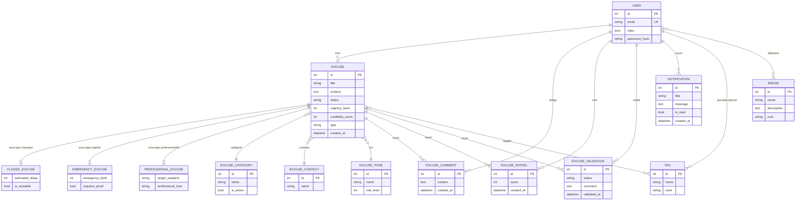

# Excusatron 3000

Application web Symfony de **génération, validation et notation d'excuses**. Les utilisateurs créent des excuses selon un contexte, une catégorie et un ton ; des validateurs les acceptent ou les refusent ; tout le monde commente, note, gagne des badges et reçoit des notifications.

> Projet de fin de cycle — Symfony 8.1 + Twig, conteneurisé avec Docker.

## Stack technique

- **PHP 8.4** / **Symfony 8.1** / **Twig**
- **PostgreSQL 16**
- **Doctrine ORM** (héritage JOINED), **API Platform** (API JSON)
- **EasyAdmin** (back-office), **Symfony Mailer** (e-mails), **HttpClient** (API météo Open-Meteo)
- **Tailwind CSS** (CDN), **Mailpit** (boîte mail de dev)
- **PHPUnit** + **PHPStan niveau 5** + **GitHub Actions CI**

## Prérequis

- Docker + Docker Compose

## Installation

```bash
# 1. Cloner le dépôt
git clone <url-du-depot> projet-symfony && cd projet-symfony

# 2. Construire et démarrer les conteneurs
docker compose up -d --build

# 3. Installer les dépendances PHP (dans le conteneur)
docker compose exec php composer install

# 4. Créer le schéma de base de données
docker compose exec php php bin/console doctrine:migrations:migrate --no-interaction

# 5. Charger les fixtures (jeu de données de test)
docker compose exec php php bin/console hautelook:fixtures:load --no-interaction
```

## Accès

| Service | Local | Prod |
|---|---| --- |
| Application | http://localhost:9000 | https://excuses.escanordev.fr |
| Back-office (admin) | http://localhost:9000/admin | https://excuses.escanordev.fr/admin |
| API JSON | http://localhost:9000/api/docs | https://excuses.escanordev.fr/api/docs |
| Adminer (base de données) | http://localhost:8080 | - |
| Mailpit (e-mails de dev) | http://localhost:8025 | https://mailpit.escanordev.fr |

## Comptes de test

Tous les comptes utilisent le mot de passe **`password`**.

| Email | Rôle |
|---|---|
| `admin@excusify.test` | `ROLE_ADMIN` |
| `validator@excusify.test` | `ROLE_VALIDATOR` |
| `alex@excusify.test` | `ROLE_USER` |
| `sam@excusify.test` | `ROLE_USER` |

## Lancer les tests

```bash
docker compose exec php php bin/phpunit
```

## Vérifications qualité (local)

```bash
docker compose exec php php bin/console lint:yaml config fixtures --parse-tags
docker compose exec php php bin/console lint:twig templates
docker compose exec php php bin/console lint:container
docker compose exec php vendor/bin/phpstan analyse --no-progress --memory-limit=512M
docker compose exec php php bin/phpunit
```

## Fonctionnalités principales

- **Authentification** sécurisée (Security Component, mots de passe hachés) et **3 rôles** (`USER`, `VALIDATOR`, `ADMIN`).
- **CRUD des excuses** avec **héritage** (excuses classiques / urgentes / professionnelles) et **formulaires dynamiques** (Form Events).
- **Voter personnalisé** pour les droits d'édition et de validation.
- **Workflow de validation** : soumission → acceptation/refus par un validateur → **notification + e-mail** à l'auteur.
- **Commentaires** et **notes** (1 à 5) sur les excuses.
- **Tags** (globaux gérés par l'admin + personnels par utilisateur), **badges** (avec attribution par admin/validateur), **notifications**.
- **API JSON** (API Platform + Serializer, groupes de normalisation).
- **API externe** : météo de Paris (Open-Meteo via HttpClient) → « météo des excuses » sur le dashboard.
- **Back-office** EasyAdmin sécurisé (`ROLE_ADMIN`).
- **Notifications métier** : soumission/resoumission, validation/rejet, nouveau commentaire, badge débloqué.
- **CI GitHub Actions** : lint YAML/Twig/container + PHPStan + PHPUnit.

## Modèle de données (MCD)

L'entité `Excuse` est abstraite et déclinée en trois sous-types via l'héritage Doctrine **JOINED** (colonne discriminante `type`).


